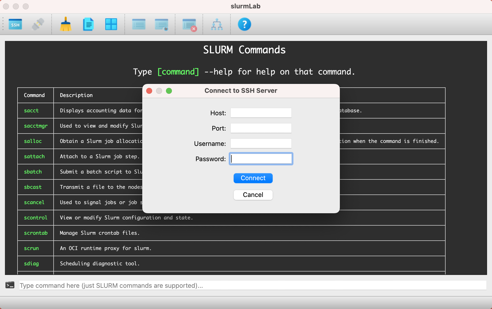

# slurmLab 🚀

slurmLab is a Python-based GUI application designed to manage and monitor SLURM jobs through an SSH connection. It provides an intuitive interface to execute common SLURM commands and view results in a formatted way.

## Screenshot



## Features 📋

- SSH connection management 📡
- Job monitoring and management 📊
- Support for common SLURM commands:
  - squeue
  - squeue -u
  - scancel
  - sinfo
- Command execution in the console 🖥️
- Formatted output in HTML tables 📈
- Copy, select all and clear functionality ✂️
- Help documentation 📚

## Requirements 🧩

- Python 3.6+ 🐍
- paramiko==3.5.1 🔑
- PyQt5==5.15.11 🎨
- PyQt5-Qt5==5.15.16 🖥️

## Installation 📦

1. Clone this repository:
   ```bash
   git clone https://github.com/arturylab/slurmLab.git

2. Create a `config.json` file in the root directory of the project and add your SSH credentials to connect to the server. The application uses this file to establish the connection.

    Example `config.json`:
    ```json
    {
         "SSH_HOST": "your.server.com",
         "SSH_PORT": 22,
         "SSH_USER": "your_username",
         "SSH_PASSWORD": "your_password"
    }
    ```

    Replace `your.server.com`, `your_username`, and `your_password` with your actual SSH connection details.
